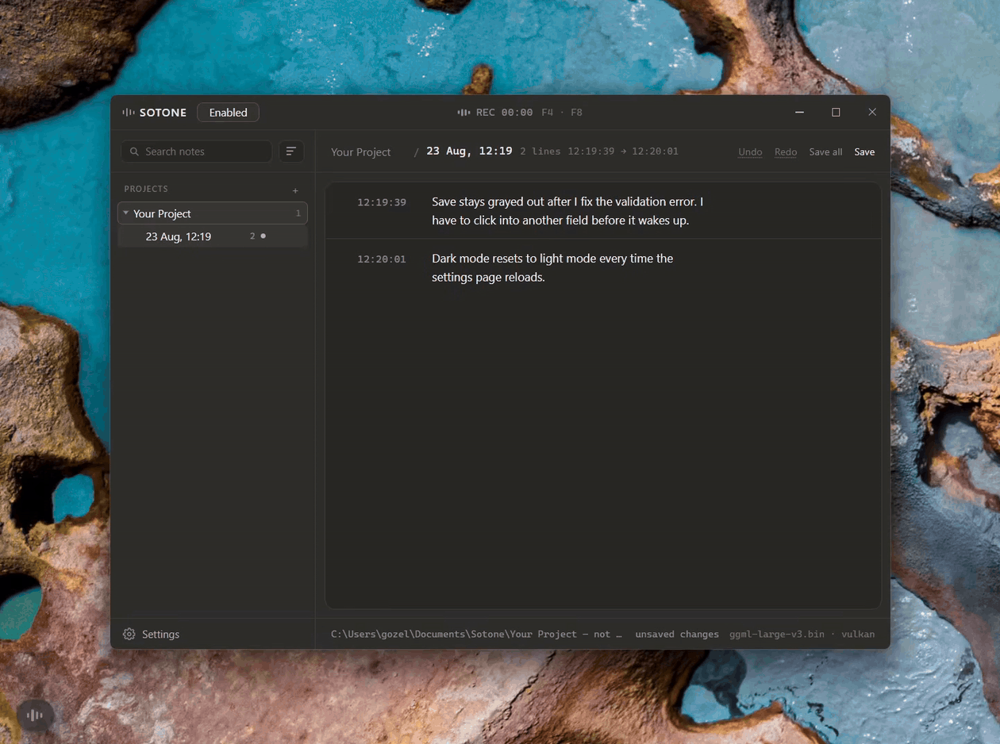

# Sotone

[](https://github.com/bsid00/sotone/actions/workflows/ci.yml)

**Take notes by voice while you test something, without typing into it.**

Sotone is a small desktop app. You hold a key, say what you noticed, and let go.
Sotone turns your speech into text on your own computer and adds it as a
timestamped line to a markdown file. It never types into the program you are
testing, and nothing is sent online. When you are done, you give the file to
your coding agent and it fixes what you found.



> **Status: pre-alpha.** There is a Windows installer on the
> [Releases](https://github.com/bsid00/sotone/releases) page, unsigned for now.
> It has only ever been run on Windows. Linux and macOS builds compile in CI
> but nobody has tried them.

## Who it is for

Anyone who builds something with a coding agent and then tries it out
themselves. You play the game, click through the app, open the spreadsheet,
watch the build. You notice things. Sotone is for writing those things down
without stopping.

It works for any kind of testing where a person is watching: game playtests,
app QA, spreadsheet and document review, build checks, design walkthroughs.

## Why

Letting the agent test the app by itself is slow and expensive. You can spot a
bug in ten seconds that the agent would need a huge number of tokens to find
on its own. So you do the testing. The annoying part is writing down what you
saw, because every time you stop to type you lose your place in the game or
the app.

Sotone takes that step away. You say it, it lands in the file, you keep going.
A few things it gets right on purpose:

- It only listens. It never types anywhere, never takes focus from the window
  you are in, and has no code in it that could fake a keypress or a mouse
  click. This is what makes it safe to run next to a game with anti-cheat.
- Everything runs locally. Speech recognition is whisper.cpp on your own
  machine. No cloud, no account, no API key, no telemetry.
- The output is boring on purpose: a plain markdown file with one timestamped
  line per thing you said. That is exactly what you paste into an agent's
  context afterwards.

Sotone is not a general dictation tool. It does one thing.

## How it works

1. Hold your push-to-talk key. If you want to talk for longer, tap the toggle
   key once to start and once to stop.
2. Say what you saw. It does not have to be tidy. Each time you talk, that is
   one line.
3. Let go of the key. Sotone transcribes the audio and adds the line to the
   note, with the time you let go as the timestamp. If you talk for more than
   two minutes in one go, Sotone splits it into two lines instead of cutting
   you off.
4. When you are finished, give the file to your agent.

A note looks like this. There is an optional header for the project, then one
bullet per line you spoke, in order:

```markdown
# Riftbound, combat pass

- 14:02:11 - dodge roll cancels the reload animation, looks like a free reload
- 14:03:47 - chest inventory sorts itself every time I open it, that's new
- 14:06:20 - boss phase 2 hitbox is bigger than the model, got hit through a pillar

---

- 19:44:33 - resumed after dinner
- 19:47:15 - the ledge fall damage repros every time, not a one-off
- 19:52:08 - settings menu has no way to rebind the dash key
```

The `---` line means you came back to the note later in a new session. You can
turn that off per project.

When you are done, paste the file into your agent's context with something
like:

> Here are my raw session notes from build \<x\>. Structure them, figure out
> which ones are bugs, which are feature requests and which are just me being
> confused, and tell me what to fix first. Don't implement anything yet.

### Or skip the pasting

Every project in Sotone has its own notes folder. If you point it at a folder
inside the repo your agent works in (say `notes/`), the notes land right
where the agent can see them. Note files are named with the date and time,
so the newest one is always easy to find.

Then one line in your `CLAUDE.md` or `AGENTS.md` is enough:

> Before you start, read the newest file in `notes/`. Those are my test
> findings from the last session. Treat them as the to-do list.

Now the loop is: the agent builds, you test and talk, you say "go", the agent
reads the notes and gets to work. Nothing to copy.

## Getting started

Get the installer from the [Releases](https://github.com/bsid00/sotone/releases)
page (the `-setup.exe` file) and run it. Windows will warn that the publisher
is unknown, because the build is not signed yet: choose "More info", then
"Run anyway". Or build it yourself: [BUILD.md](BUILD.md) lists what you need
and the commands. After that:

1. Start Sotone. The first time, a short setup wizard asks for your microphone,
   the folder to save notes in, your keys, a speech model and a name for your
   first project.
2. Get a model. Sotone does not come with one. Put a Whisper model file (GGML
   format, `.bin`) in the folder the wizard shows you. The [Models](#models)
   section says where to get one and which size to pick.
3. Set your keys. The defaults are F13 for push-to-talk and F14 for toggle.
   Most keyboards do not have those keys, which is on purpose: nothing else
   uses them. Pick keys that the thing you are testing ignores, like a spare
   F-key, a numpad key or a side button on your mouse.
4. Hold the key and say something. The line shows up in the note and on the
   small pill in the corner of the screen.
5. Close the window. Sotone keeps listening from the system tray. To quit for
   real, use *Exit Sotone* in the tray menu.

## Models

Sotone does not include a speech model and never will, not in the repo and not
in the installer. It reads Whisper models in GGML format (`.bin` files).

The whisper.cpp project publishes ready-made GGML versions of the official
Whisper models on Hugging Face:
[`ggerganov/whisper.cpp`](https://huggingface.co/ggerganov/whisper.cpp).
If you want to convert your own fine-tuned model, that is up to you, and it
works at your own risk.

Managing models is just managing a folder. Sotone looks in `models_dir`, scans
it when it starts and when you press rescan, and *Open models folder* in
Settings opens it for you. To add a model, copy the file in. To remove one,
delete it. Sotone checks every file it finds (the GGML header, and whether it
is an English-only or multilingual model) and lists broken files with the
reason instead of letting you pick them.

Rough sizes, so you know what to expect:

| Model | File size | VRAM needed |
|---|---|---|
| tiny / tiny.en | about 75 MB | about 1 GB |
| base / base.en | about 140 MB | about 1 GB |
| small / small.en | about 465 MB | about 2 GB |
| medium / medium.en | about 1.5 GB | about 5 GB |
| large-v3 | about 3.1 GB | about 10 GB |

The `.en` versions only understand English. For English speech they are
usually faster and more accurate than the multilingual model of the same size.

## Under the hood

Sotone is written in Rust and uses Tauri v2 for the window. The user interface
is plain HTML, CSS and JavaScript with no framework and no build step. The
Rust code is split into three crates:

- `sotone-core` does the actual work: recording, the hotkey logic, running
  whisper, storing drafts and writing the markdown. It knows nothing about
  windows.
- `sotone-hook` is a tiny separate program that watches for your keys and tells
  the main app over a pipe.
- `sotone` is the Tauri app: the window, the tray icon, settings.

This is the path from your voice to the file:

```
sotone-hook.exe (key presses) --pipe----+
                                       +--> worker --> whisper --> draft store --> note.md
microphone --> ring buffer ------------+                          (jsonl + wav)      ^
                                                                                     |
                                                                              Sotone window
                                                                              (edit, save)
```

Some details that matter:

- The microphone is opened once and stays open. Sotone keeps the last 400 ms of
  audio in a buffer at all times, so the first word after you press the key is
  not lost. It also keeps recording for a moment after you let go, so the last
  word is not cut off.
- On Windows, key presses are read through Raw Input. That is a passive way of
  seeing keyboard and mouse events. Sotone does not install a hook and never
  blocks or delays an event.
- Speech recognition is whisper.cpp through the `whisper-rs` crate. The Vulkan
  build uses your GPU. There are also CPU and Metal builds. Which one you get
  is decided when you compile; which model you use is decided when you run.
- Every line you speak is also saved as its own small wav file next to the
  draft, so you can play it back or transcribe it again later.
- Sotone is careful with your notes. Saves are atomic (write a temp file, then
  rename it). Deleting a note moves it to a `.trash` folder. If a note was
  edited by something else since Sotone last saved it, Sotone notices and asks
  before writing over it.

Other libraries doing real work: `cpal` for recording, `rubato` for resampling
to 16 kHz, `ringbuf` for the audio buffer, a trimmed-down copy of `rdev` for
watching keys (the parts that could send fake input are removed), `toml_edit`
so the config file keeps its comments and order when saved, `blake3` for the
change check on notes, `hound` for wav files, and
`tauri-plugin-single-instance` so starting Sotone twice just brings up the
existing window.

## Anti-cheat

If you want to run Sotone next to a game with anti-cheat, here is exactly what
it does and does not do:

- There is no code in this project that can send keystrokes or mouse events.
  No `SendInput`, no `enigo`, no input-simulation library anywhere in the
  dependency tree. Sotone can only listen.
- Sotone is not in the path between your keyboard and the game. It reads key
  presses through Windows Raw Input, which is the passive mechanism Microsoft
  recommends over low-level hooks. The game and the OS never wait for Sotone.
  The game gets your keypress exactly as if Sotone was not running.
- The part that watches keys runs in its own small process, `sotone-hook.exe`,
  separate from the main app.
- If you only bind keyboard keys, Sotone does not register for mouse input at
  all. If you bind a mouse side button, it starts listening to mouse events
  too, still read-only.
- Nothing leaves your machine. No telemetry, no crash reports, no update
  check. The only network traffic Sotone will ever make is a model download
  that you start yourself.
- The pill in the corner never takes focus and cannot be activated. One
  honest note: it is a real window, so if you click exactly on it, the click
  goes to the pill and not to what is under it. It stays out of your way by
  being small and in a corner, not by being click-through.

Because Sotone does not consume keys, your hotkey still reaches the game. So
pick a key the game does not use.

None of this is a promise about how any particular anti-cheat will react.
That is up to the anti-cheat vendor. This section only describes what the
code does.

## Known problems

This is pre-alpha software. Here is what is not done or not great yet:

- Only Windows has actually been used. The Linux and macOS builds compile in
  CI but have never been run.
- The builds are not signed. SmartScreen or Smart App Control will warn you
  about an unknown publisher, whether you run the installer or a `sotone.exe`
  you built yourself. Each release ships a `SHA256SUMS.txt` so you can check
  that the file you downloaded is the one CI built. Code signing may come
  later.
- The default keys (F13 and F14) do not exist on most keyboards. Change them
  in Settings.
- Sotone drops recordings that are too quiet, to stop whisper from inventing
  words out of silence. This is a simple volume check, not real voice
  detection. A loud cough can still turn into a line, and a very quiet
  speaker can get dropped.
- The pill is not click-through (see above).
- The per-project `vocabulary` setting is saved but not used yet.
- The filename tokens `{session}`, `{n}` and `{build}` do not work yet. They
  are left in the filename as written.
- Starting Sotone twice brings up the existing window instead of a second copy.
  What happens when one copy is run as administrator and the other is not has
  not been tested.

## What's next

Roughly in this order:

- Code-signed Windows builds.
- Per-project vocabulary passed to whisper as a hint, so it stops mishearing
  the same words.
- Real voice detection for the quiet-recording check. This needs a small
  model, which has to follow the same rule as everything else: nothing
  bundled.
- Spoken corrections ("replace X with Y") and an optional "redo last line"
  key.
- Reloading the config when you edit the file by hand while Sotone is running.
- Getting Linux and macOS actually running and tested.

## Configuration

The config file is the source of truth. The Settings screen in the app is just
an editor for it. You can edit the file by hand if you like. It is plain TOML,
and Sotone keeps your comments, key order, blank lines and any keys it does not
know about when it saves.

Location: `<platform config dir>/sotone/config.toml`. On Windows that is
`%APPDATA%\sotone\config.toml`.

### Top level

| Key | Type | Default | What it does |
|---|---|---|---|
| `models_dir` | path | `<platform data dir>/sotone/models` | The folder Sotone looks in for model files. |
| `active_model` | string, optional | none | Filename of the model to use. |
| `language` | string | `"auto"` | Language to transcribe in, or `"auto"` to let whisper guess. |
| `hotkey` | string | `"F13"` | The push-to-talk key. Hold to record. |
| `toggle_hotkey` | string | `"F14"` | The toggle key. Press once to start, again to stop. |
| `ptt_enabled` | bool | `true` | Whether the push-to-talk key is active. |
| `toggle_enabled` | bool | `true` | Whether the toggle key is active. At least one of the two has to stay on. |
| `mic_substring` | string, optional | none (uses the default device) | Picks a microphone by part of its name, never by its number in the list. |
| `audio_cues` | bool | `true` | Play the small sounds for recording, saved and error. |
| `overlay` | bool | `true` | Show the pill in the corner of the screen. |
| `overlay_corner` | string | `"bottomLeft"` | Which corner: `"bottomLeft"`, `"bottomRight"`, `"topLeft"` or `"topRight"`. |
| `reveal_seconds` | integer | `10` | How long a new line stays visible on the pill, from 3 to 60. |
| `theme` | string | `"dark"` | `"dark"` or `"light"`. |
| `close_quits` | bool | `false` | If `true`, closing the window quits Sotone. By default closing hides it to the tray and it keeps listening; *Exit Sotone* in the tray menu quits. During the setup wizard, closing always quits. |
| `hide_deleted` | bool | `false` | If `true`, deleted lines are hidden in the note view. Nothing changes on disk; the note keeps every line and *Show deleted lines* brings them back. |
| `onboarded` | string | `"no"` on a fresh install | Whether the setup wizard has finished: `"no"`, `"first-launch"` or `"yes"`. **The wizard manages this. Do not edit it by hand.** A config file from before the wizard existed counts as `"yes"`. |
| `active_project` | string, optional | none | The currently selected project. |
| `projects` | list of `[[projects]]` tables | empty | Your projects, see below. |

### Per project (`[[projects]]`)

| Key | Type | Default | What it does |
|---|---|---|---|
| `name` | string, required | none | The project's name. Also used for the `{project}` part of filenames. |
| `notes_dir` | path | required | The folder notes are saved in. |
| `filename_template` | string | `"{project} {date} {time}.md"` | How note files are named. Available: `{project} {date} {time} {datetime}`. `{session}`, `{n}` and `{build}` are not implemented yet and are left as written. |
| `header_template` | string, optional | none | Text put at the top of every note, as is. |
| `model` | string, optional | none (uses `active_model`) | A different model for this project. |
| `language` | string, optional | none (uses `language`) | A different language for this project. |
| `vocabulary` | list of strings | empty | Words whisper keeps getting wrong in this project. Saved, but **not used yet**. |
| `session_dividers` | bool | `true` | Whether coming back to a note later adds a `---` line. |

## Contributing

Read [CONTRIBUTING.md](CONTRIBUTING.md) first. It is short. The main thing is
six rules that are not up for discussion: no fake input, never steal focus,
nothing leaves the machine, never destroy notes, never block the input hook,
no bundled models. It also lists the checks a pull request has to pass, and
asks you to say what you tested by hand, because things like audio quality
and hotkeys inside a real game cannot be checked by a script. Keep pull
requests small and say what you changed and why.

## License

MIT, see [LICENSE](LICENSE). Licenses of the libraries Sotone ships with are
summarised in [THIRD_PARTY_NOTICES.md](THIRD_PARTY_NOTICES.md).

## Acknowledgments

- **Whisper** by OpenAI, the speech recognition model.
- **whisper.cpp and ggml** by Georgi Gerganov and contributors, which is why
  it runs locally on normal hardware.
- **whisper-rs** for the Rust bindings.
- **Tauri** for the app framework.
- **rdev** by Nicolas Patry, which the key listener is built on.
- **[Handy](https://github.com/cjpais/Handy)**, whose README inspired the
  shape of this one.
